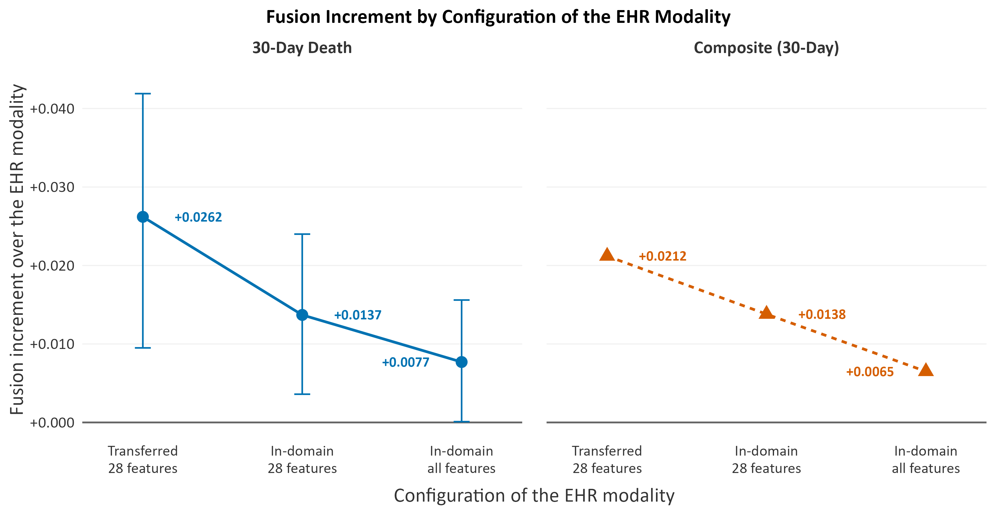
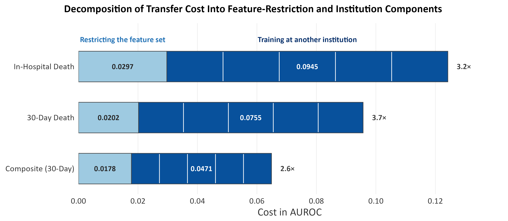

# Multimodal Predictive Modelling of Cardiovascular Outcomes in Pulmonary Embolism Patients

MSc Data Science dissertation, University of Sheffield, 2026.

This repository holds the analysis code, the R figure scripts and the aggregate result tables behind the dissertation. It is research code shared for transparency and reproducibility, not a maintained software package.

## Summary

Risk after acute pulmonary embolism (PE) is usually stratified with the simplified Pulmonary Embolism Severity Index (sPESI), which is sensitive but not specific and predicts mortality alone. This project built a late-fusion ensemble of four modalities to predict 30-day outcomes after PE: structured electronic health records (EHR), 12-lead electrocardiograms (ECG), computed tomography pulmonary angiography (CTPA) report text and chest radiographs (CXR). The EHR modality was trained on Stanford INSPECT and applied without any target labels to MIMIC-IV, while the other modalities were trained within MIMIC-IV under subject-level cross-validation. Predictions were combined by weighted rank averaging, with the weights selected inside each training fold, and compared with the six-criterion sPESI.

## Key results

Three-modality cohort (EHR, ECG and CTPA report), 1,703 MIMIC-IV admissions:

| Endpoint | Events | Weighted fusion AUROC | Gain over best single modality | Gain over sPESI-6 |
|---|---|---|---|---|
| 30-day death | 157 | 0.8715 | +0.0262 | +0.1020 |
| Composite (death or cardiovascular readmission, 30 days) | 229 | 0.8389 | +0.0212 | +0.0758 |

All confidence intervals for these gains excluded zero. Fusion added nothing for cardiovascular readmission alone (3,131 admissions, 171 events, +0.0032).

The fusion gain depended on how constrained the primary modality was. With the ECG and CTPA predictions held identical and only the EHR modality strengthened, the increment for 30-day death fell from +0.0262 to +0.0137 to +0.0077.

  

*Fusion increment over the EHR modality alone at three configurations of that modality, on the same 1,703 admissions. The ECG and CTPA predictions are identical at every step. Intervals are shown for 30-day death only.*

Zero-shot transfer from INSPECT to MIMIC-IV cost 0.047 to 0.095 AUROC for structured measurements, 2.6 to 3.7 times the cost of restricting the model to features measurable at both sites. For CTPA report text the transfer cost was only 0.012 to 0.018.

  

*Transfer cost of the EHR modality against an unconstrained model trained within MIMIC-IV, split into the cost of restricting the feature set and the cost of training at another institution. The multiplier gives the ratio of the two.*

## Data access

This repository contains no patient data, no patient-level derived files (predictions, feature matrices, labels) and no fitted models. Models trained on MIMIC-IV count as derived data under the PhysioNet data use agreement, so they cannot be shared here.

To reproduce the analyses you need your own access to:

- MIMIC-IV, MIMIC-IV-ED, MIMIC-IV-Note, MIMIC-IV-ECG and MIMIC-CXR-JPG (PhysioNet credentialed access)
- MIMIC-IV-Ext-PE (PhysioNet), used by scripts 98 and 98a
- INSPECT (Stanford AIMI, via Redivis, under the Stanford data use agreement)
- the PTB-XL benchmark weights published by Strodthoff et al. (2020), used for the ECG modality

## What is in this repository

| Folder | Contents |
|---|---|
| `scripts/` | Python analysis scripts, numbered in the order they were written (63 to 151), plus unnumbered helpers |
| `scripts/figures/` | Figure and table helpers, the scripts that export data for the R figures, and an earlier set of matplotlib figure scripts |
| `R/` | R scripts that drew every chart in the dissertation |
| `results/` | Aggregate result tables, one row per model, outcome or cell |
| `figures/` | PNG files from the dissertation's R figure folder, including superseded drafts |

Scripts numbered below 63 (cohort extraction, the original EHR feature pipeline and ECG feature extraction) are not included. The repository starts from their outputs.

## Running the code

The scripts ran on the University of Sheffield's Stanage HPC cluster, in five Python environments listed with their package versions in Table 44 of the dissertation.

**Workspace layout.** Paths are relative to a workspace folder laid out as on the cluster, containing `fusion_workspace/`, `phase2_mimic/` and `inspect_workspace/`. Place this repository's `scripts` folder at `fusion_workspace/scripts` and run every script from the workspace folder, because three scripts (`build_table41_baseline.py`, `export_patterns.py` and `phase_audit.py`) import from `fusion_workspace/scripts`.

**Environment variable.** The eight BigQuery scripts (87, 87a, 117, 118, 118a, 119, 125 and 135) read the Google Cloud project from `GCP_PROJECT_ID`. Set it before running them.

**External resources** expected at these paths:

| Script | Needs |
|---|---|
| `94_build_ctpa_notes.py` | MIMIC-IV-Note radiology file at `./mimic_note/radiology.csv.gz` |
| `98_ctpa_factorial.py`, `98a_diag.py` | MIMIC-IV-Ext-PE at `./mimic_ext_pe/physionet.org/files/mimic-iv-ext-pe/1.0.0/` |
| `122_build_mapping.py` | the `mimic-omop` repository at `./mimic-omop` |
| `scripts/figures/fig22_ecg_statements.py` | `mlb.pkl` from the PTB-XL benchmarking repository, at `~/ecg_ptbxl_benchmarking/output/exp0/data/` |

**Figure helper order.** Run `fig11_forest.py` before `tables_export.py`, and run `fig11_forest.py` and `fig12_weights.py` before `fig25_gap_ladder.py` and `fig33_when_to_fuse.py`.

**R figures.** The R scripts read their input tables from `Documents/Data Science/Dissertation/figwork/data` and save images to `Documents/Data Science/Dissertation/R graphs`, both under the Windows user profile. Change `data_dir` and `fig_dir` at the top of a script to run it elsewhere.

**Local language model.** Scripts 147 to 151 ran Qwen2.5-7B-Instruct locally on a cluster GPU. No report text left the cluster.

## How the scripts are organised

| Scripts | Stage |
|---|---|
| 63 to 74 | Phase 1: first fusion comparisons, CXR timing and shortcut tests, and the split of the original composite into death and cardiovascular readmission. These use the superseded outcome label and are kept for transparency. |
| 75 to 80 | Outcome labels: INSPECT index visits and labels (76 to 78; 75 is superseded) and the harmonised MIMIC-IV labels (80) |
| 82 to 86 | Phase 2: ECG predictions on the harmonised labels, two-modality fusion, weighted fusion and the evaluation against sPESI |
| 87 to 89 and `fix_cxr_agg.py` | CXR modality on the harmonised labels, Grad-CAM, the CXR three-modality model and acquisition-context checks |
| 87 to 93, 96, 107 to 112 | Searches for CTPA report text in INSPECT and MIMIC-IV, and gated, early and late fusion tests |
| 94 to 106 | CTPA report modality: report extraction, feature sets, the presentation window, three-modality fusion and the sPESI-6 recheck |
| 113 to 117 | INSPECT-trained models applied to MIMIC-IV, count-based features and the MIMIC-IV history-depth check |
| 118 to 127 | Expansion of the EHR modality to 28 features measurable at both sites, retraining, and regeneration of its predictions |
| 128 to 139 | Analyses on the 28-feature model: early against late fusion, explainability, subgroups, decision-curve calibration, the within-MIMIC ceiling, interactions and covariate shift |
| 140 to 145 | Fusion architectures (supervised fusion, meta-learners, joint MLP) and decision curves |
| 146 to 151 | CTPA explainability and local language-model extraction of CTPA findings |
| unnumbered | Confidence-interval and table helpers (for example `unimodal_ci.py`, `spesi_ci.py`, `build_table41_baseline.py`) and audits (for example `audit_fusion_inputs.py`, `phase_audit.py`) |

Some numbers are shared by two scripts (for example `87_ctpa_report_coverage.py` and `87_cxr_harmonised.py`), because two workspaces were numbered independently.

## Figure map

Every chart in the dissertation was drawn in R. Figures 3 to 6 are diagrams drawn outside the code. `R code 1.R`, `R code 2.R` and `R code 3.R` hold successive drafts of each figure in the order written; the last draft that saves a given image name is the one used.

| Dissertation figure | R file | Image name |
|---|---|---|
| 1 | `R code 3.R` | `fig1_cause_of_death` |
| 7a to 7c | `R code 3.R` | `fig7a_beeswarm_death_30d`, `fig7b_beeswarm_composite_30d`, `fig7c_beeswarm_cv_first` |
| 8 | `R code 3.R` | `fig13_quartile_rates` |
| 9 | `R code 3.R` | `fig14_rank_concordance` |
| 10a to 10c | `R code 3.R` | `fig10a_ecg_composite`, `fig10b_ecg_death_30d`, `fig10c_ecg_cv_first` |
| 11a to 11c | `R code 3.R` | `fig11a_ctpa_death_30d`, `fig11b_ctpa_composite`, `fig11c_ctpa_cv_first` |
| 12a, 12b | `R code 3.R` | `fig12a_cxr_vs_context`, `fig12b_cxr_portability_strata` |
| 13 | `fig_spesi_dca.R` | `fig_spesi_dca` |
| 14 | `R code 3.R` | `fig14_spesi_agebands` |
| 15 | `R code 3.R` | `fig15_interval_width` |
| 16 | `R code 3.R` | `fig16_stability_folds` |
| 17 | `R code 1.R` | `fig_roc_panel` |
| 18 | `R code 3.R` | `fig18_fusion_rules` |
| 20 | `R code 3.R` | `fig20_weights2` |
| 21 | `R code 3.R` | `fig21_w2_pairings` |
| 22 | `R code 3.R` | `fig22_twoway_disagree` |
| 23 | `R code 1.R` | `fig_roc3_panel` |
| 24 | `fig20_weights3.R` | `fig20_weights3` |
| 25 | `R code 3.R` | `fig20b_weights3cxr` |
| 26 | `R code 2.R` | `fig24_threeway_disagree` |
| 27 | `R code 2.R` | `fig4_calibration` |
| 28 | `R code 3.R` | `fig14b_sex` |
| 29 | `R code 3.R` | `fig14a_age_bands` |
| 30 | `R code 3.R` | `fig30_time_to_event` |
| 31 | `R code 3.R` | `fig31_time_to_event_route` |
| 32 | `R code 3.R` | `fig32_fusion_architectures` |
| 33 | `R code 3.R` | `fig33_transfer_cost` |
| 34 | `R code 3.R` | `fig34_corr_shift` |
| 35 | `R code 3.R` | `fig35_supervision_ladder` |

The data for Figures 7a to 7c come from `scripts/figures/export_shap_long.py`, for Figures 30 and 31 from `scripts/figures/export_decomp_p2.py`, for Figure 13 from `145_dca_plot.py`, and for Figure 24 from `scripts/figures/export_wmean3_weights.py`.

The Python figure scripts `scripts/figures/fig01` to `fig34` are an earlier figure set that was replaced by the R figures and does not appear in the dissertation.

## Notes on the code

- **Two versions of the EHR predictions.** Scripts 84 to 115 used predictions from the earlier 15-feature EHR modality. `127_regen_pehr.py` overwrote them with predictions from the 28-feature model, which scripts 128 onwards use.
- **CXR aggregation.** `87_cxr_harmonised.py` matched films to admissions on `dicom_id` alone. `fix_cxr_agg.py` repeats the aggregation matching on `dicom_id` and `hadm_id`, and its outputs are the CXR results reported. The "+CXR" results printed by scripts 88 to 93 predate this fix.
- **sPESI.** `104_ro4_ctpa.py` may compute the five-criterion sPESI. The six-criterion benchmark is recomputed in `106_spesi6_recheck.py`.
- **CTPA script chain.** 95 and 97 lead to 98 and 99, which lead to 100, 102 and 103. The reported CTPA numbers come from the last three.
- **Subgroups.** `130_subgroups.py` bootstraps by resampling admissions rather than patients.
- **Interactions.** In `137_interactions.py`, `ix_ca_alb` holds calcium alone.
- **Decision curves.** `144_dca.py` is a draft that was not used. The reported decision curves come from `145_dca_plot.py`.
- **Baseline table.** Table 10 of the dissertation comes from `build_table41_baseline.py`. `scripts/figures/tab06_baseline.py` is an earlier version.

## Differences from the submitted dissertation

Figure titles and labels in the code were standardised after submission (for example, "arm" became "modality"), and comments were shortened. The images in `figures/` are the submitted versions, so a fresh run differs from them in wording only, not in any value shown.

Errors found in the submitted dissertation since submission:

1. **Abstract.** The EHR modality is described as trained on 4,524 PE-positive INSPECT patients. That is the number of PE-coded patients; the model was trained on the 3,300 with an index CTPA within 30 days of diagnosis, as stated in Section 3.3 and Table 10.
2. **INSPECT cohort diagram (the second figure numbered 3).** The final box gives a training cohort of 3,136, excluding patients censored for 1-month mortality. That restriction applied only to the count-feature comparison (`116a_build_counts.py`). The EHR modality was developed on all 3,300. The second box also reads 4,525 where the text gives 4,524.
3. **Prior history in INSPECT and MIMIC-IV (Section 3.3 and Table 40).** The INSPECT figure of 377 is the median number of distinct pre-index codes of every type per patient (diagnoses, laboratory tests, drugs and procedures, including three-character parent groupings). The MIMIC-IV figure of 4 counts diagnosis codes from prior admissions only. The two are not the same measure, although the conclusion stands: 47.2% of MIMIC-IV admissions have no prior record at all.

## Citation and licence

If you use this code, please cite it using `CITATION.cff`, and cite MIMIC-IV, PhysioNet, INSPECT and PTB-XL as their providers request. The code is released under the MIT licence (see `LICENSE`).
